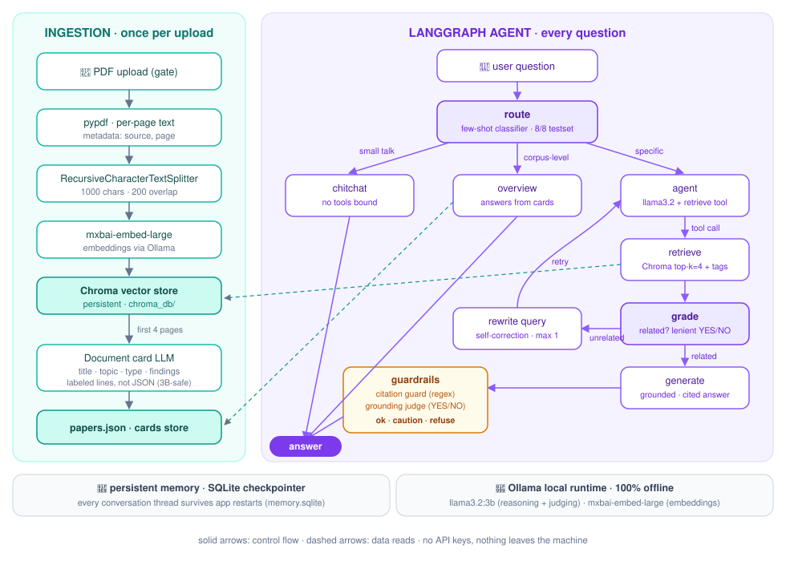

# 🔬 Doc Companion — Local Agentic RAG for Your PDFs


Upload your PDFs — research papers, class notes, reports, personal documents — and work with them like a partner: structured document cards, cited answers, and graduated safety guardrails. **Fully offline. No API keys. Nothing leaves your machine.**

The LLM here is not a single-shot pipeline. It is the reasoning engine of a **LangGraph agent** that routes each question, decides when to retrieve, grades its own retrieval, rewrites bad queries, and answers behind graduated guardrails: verified, cautioned, or refused.

## Architecture



## How a question flows

1. **Route** — a few-shot classifier sends each message down the right path: small talk, corpus-level, or specific (8/8 on the routing testset; 6/8 without few-shot examples).
2. **Overview path** — "summarize my documents" is a known weakness of top-k retrieval: no k chunks represent a whole corpus. These questions answer from per-document **cards** built at ingestion time.
3. **Search path** — the agent calls its retrieve tool, **grades** the chunks, **rewrites** the query once if retrieval missed (reflection), then generates a grounded answer with `[file p.N]` citations.
4. **Guardrails** — a deterministic regex guard repairs or drops invented citation tags, and an LLM judge checks grounding: verified answers ship clean, unverified ones carry a caution note, and refusal is reserved for topics the documents genuinely don't cover.
5. **Memory** — a SQLite checkpointer persists every conversation thread across app restarts.

## Design decisions (the "why")

- **Agent, not chain.** A fixed retrieval chain retrieves for every message, even "hello". Here control flow is an explicit graph and the LLM reasons inside it.
- **Graduated guardrails, not binary refusal.** Hard refusal had too many false positives with a 3B judge on long documents — good answers were being replaced. Verify → caution → refuse is the reliability curve that survived real testing.
- **Small-model engineering, measured not assumed:**
  - JSON-constrained structured output was unreliable for verdicts on llama3.2:3b (tested: it defaulted to `false`). Every judge uses plain-text YES/NO or labeled-line formats instead.
  - The model calls its tool on every message once tools are bound, so routing is an explicit few-shot classifier node.
  - Prompt structure matters: instruction-first wording made the model claim its context was empty; context-first, question-last fixed it.
- **Chunking: recursive, 1000 chars / 200 overlap.** Paragraph → line → word boundaries keep chunks semantically whole; overlap keeps boundary-straddling facts retrievable.
- **Chroma over in-memory FAISS.** Persistent index with per-page metadata for citations, still zero-server. pgvector when the corpus needs concurrent writers.
- **Everything local.** Models run via Ollama. [rag/config.py](rag/config.py) is the single place to swap models or tune parameters.

## Limitations

- The 3B grounding judge catches gross hallucination but can miss subtle, mixed claims. Point `CHAT_MODEL` at an 8B+ model for judging when hardware allows.
- `pypdf` extracts plain text only, so scanned or image-based PDFs need OCR first.

## Run it

```bash
# 1. Ollama + models (~2.7 GB)
brew install ollama          # or https://ollama.com
ollama serve                 # in its own terminal
ollama pull llama3.2:3b
ollama pull mxbai-embed-large

# 2. Python env (uv: https://docs.astral.sh/uv/)
uv sync

# 3. App
uv run streamlit run app.py
```

Upload PDFs → **Analyse documents** → chat. A sample PDF to try: [docs/sample_study_notes.pdf](docs/sample_study_notes.pdf).

## Evaluation

A golden Q&A set ([evals/golden.jsonl](evals/golden.jsonl)) is scored by an LLM judge on **faithfulness** (answer grounded in retrieved context) and **correctness** (matches reference answer):

```bash
uv run python -m evals.run_eval
```

## Project layout

```
app.py              Streamlit UI: upload gate, document cards, sidebar, chat
rag/config.py       every model name and tunable in one place
rag/ingest.py       PDFs -> pages -> chunks -> Chroma, plus document cards
rag/agent.py        the LangGraph agent (routing, nodes, edges, checkpointer)
rag/guards.py       grounding judge + citation guard + refusal
evals/              golden set + LLM-as-judge harness
```

## License

MIT
